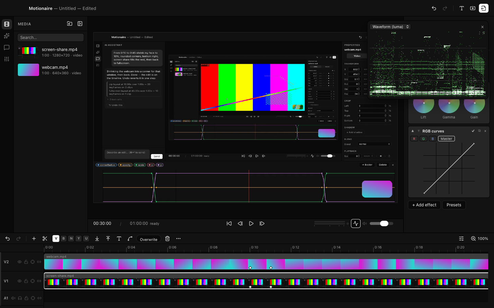
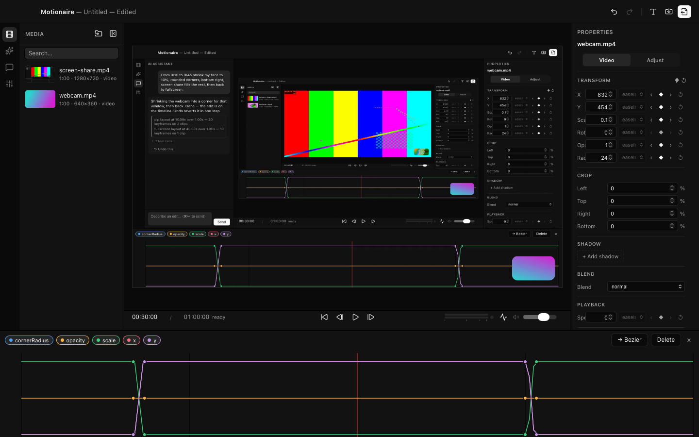

# Motionaire

**An AI-native video editor for macOS.** Type *"From 0:10 to 0:45 shrink my
face to 10%, rounded corners, bottom right, screen share fills the rest, then
back to fullscreen"* — and it happens: real keyframes on a real timeline,
live in the preview, one undo step, identical in the export.


Built for screen recordings and talking-head content: multi-track timeline,
a Rust/wgpu compositor shared by preview and export, professional trim
tools, color grading with scopes, pro audio, and an AI layer that edits the
project the same way you do.

## Download

**[Download the latest DMG →](https://github.com/4mohdisa/motionaire/releases/latest)**

Requirements: **macOS 13+ (Apple Silicon)** and **FFmpeg** on your PATH
(`brew install ffmpeg`) — Motionaire uses your FFmpeg for decode, proxies,
and export, and tells you at launch if it can't find one.

> **The app is not notarized yet.** Notarization requires an Apple Developer
> Program membership this project doesn't have yet, so macOS Gatekeeper will
> warn on first launch ("Motionaire" can't be opened…). This is the warning
> every unsigned open-source app gets — it does not mean the app is harmful,
> and you can read every line of it here. To open:
> **right-click the app → Open → Open**, or clear the quarantine flag:
>
> ```bash
> xattr -cr /Applications/Motionaire.app
> ```

## What it does

**Editing**
- Multi-track timeline: drag, trim, split, ripple delete, snapping, markers,
  in/out marks, insert/overwrite, group drag, marquee, labels, timecode entry
- Professional trim tools: ripple, roll, slip, slide (V/B/N/Y/U), track
  targeting, sync lock, compound clips
- Keyframes on every property with a bezier graph editor; speed ramps
- Media bin with search, folders, relink, offline handling, source monitor
  with in/out; hover-scrub filmstrips; freeze frames; proxies for 4K footage

**Look & sound**
- Ordered effect stack: chroma key, grade, blur/sharpen, masks, vignette,
  color wheels, RGB curves, 3D LUTs — plus adjustment layers and track mattes
- Scopes (waveform, parade, vectorscope, histogram) reading the compositor's
  actual output
- 16 transitions, motion blur, auto-reframe, safe zones and guides
- Pro audio: waveforms, mixer, dBFS meters, pan, fades, ducking, EQ,
  compressor, gate, de-esser, LUFS normalize — all verified in exported files
- Text and titles rendered inside the compositor (WYSIWYG in export), font
  import embedded in the project bundle, shapes, title templates

**Export**
- H.264, HEVC, ProRes 422, GIF, PNG sequence, M4A — hardware-encoded where
  available, with range export, presets, chapters, background export and a
  queue

**AI**
- **Chat that edits the timeline.** The AI calls the same mutations the UI
  uses — never pixels — so every edit lands as normal, hand-editable clips
  and keyframes. One prompt = one undo step, always.
- Layout macros: "picture-in-picture bottom right at 10%" is one tool call
  that coordinates keyframes across every affected track
- AI video generation (Seedance, Google Veo) straight into the media bin,
  with plain-English cost warnings before anything spends your credits
- An offline mock provider runs the demo prompts with no key and no network


| Color wheels, RGB curves, scopes reading the live output | The keyframe graph editor on an AI-written move |
|---|---|
|  |  |

## AI setup

Preferences (⌘,) → **AI**: pick Anthropic or OpenAI, paste an API key, Test
connection. **Keys are stored in the macOS Keychain and are only ever read
by the Rust core** — they never enter the UI layer, never appear in logs,
never leave your machine except to the provider you chose. Video generation
(Seedance / Google) configures the same way. No key? The offline mock
provider demos the editing flow for free.

## Build from source

Prerequisites: [Node.js](https://nodejs.org) 20+, [Rust](https://rustup.rs)
(stable), `ffmpeg`/`ffprobe` on PATH, Xcode Command Line Tools.

```bash
npm install          # JS deps; Rust deps fetch on first build
npm run tauri dev    # dev app with hot reload
npm test             # full suite: unit (TS+Rust) → e2e → visual regression
bash scripts/release.sh   # release .app + .dmg
```

## Architecture (the interesting part)

```
prompt → LLM → tool calls → project JSON → wgpu compositor → preview + export
```

- **The AI edits the timeline, not the pixels.** The project is a JSON
  document; the UI mutates it through a store; the AI mutates it through
  the *same store actions* via a tool-call layer. The AI cannot produce a
  corrupt frame because it never produces frames.
- **One prompt = one undo step.** Every tool call in a turn coalesces into
  a single history entry — an AI edit is exactly as reversible as a drag.
- **One compositor, two callers.** A Rust/wgpu multi-pass renderer draws the
  preview in real time and the export frame-by-frame — same code, so what
  you see is what encodes. FFmpeg handles decode/encode as subprocesses.
- **Keys live in the OS keychain, read only by Rust.** Provider HTTP happens
  in the Rust core; the webview sends intent and receives streamed results.

More in [CONTEXT.md](CONTEXT.md) (technical spec), [DECISIONS.md](DECISIONS.md)
(append-only engineering log across all fourteen build sessions), and
[DEMO.md](DEMO.md) (presenter script).

## Testing

`npm test` runs four layers — frontend unit (vitest), Rust unit (cargo),
41 end-to-end scenarios against the real app and real compositor via a
dev-remote runner (macOS WKWebView has no WebDriver endpoint, so the runner
drives the actual window), and visual regression via self-captured
screenshots compared by SSIM. [TESTING.md](TESTING.md) documents the house
rules. The audit trail for the release is in [AUDIT.md](AUDIT.md).

## Known limitations

- **macOS only** (Apple Silicon; the compositor targets Metal via wgpu).
- **Not notarized yet** — see the Gatekeeper note under Download.
- **Real-provider AI paths are built against current provider docs but were
  verified with a mock provider** — no API key existed on the build machine.
  The mock emits the same tool calls a real model would; everything
  downstream (macro → keyframes → compositor → export) is identical either
  way. Report anything odd with a real key.
- Track audio effects have no mixer UI yet (they work via the AI/store).
- Speed-ramped clips are video-only (their audio is muted by design).
- No transcription/captions yet; overlay blend mode and face-tracking
  auto-reframe are not implemented (activity-centroid reframe is).

## License

**AGPL-3.0-only** — free to use, study, and modify; if you distribute a
modified version or run one as a service, your changes must be open too.
Copyright © 2026 **Mohammed Isa**. See [LICENSE](LICENSE) and
[THIRD_PARTY.md](THIRD_PARTY.md).

## Author

**Mohammed Isa** ([@4mohdisa](https://github.com/4mohdisa)) — sole author.
