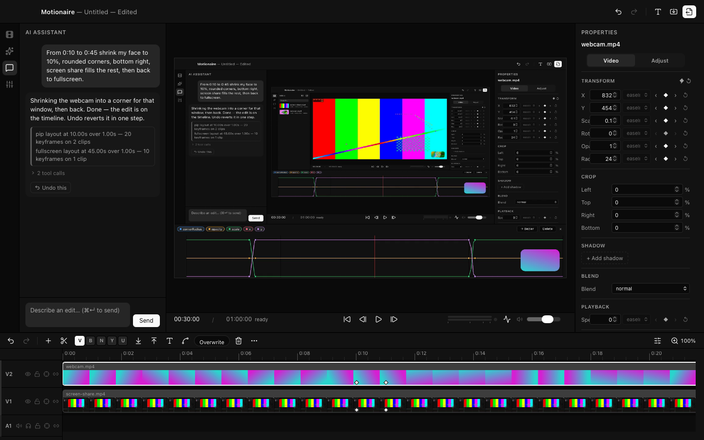
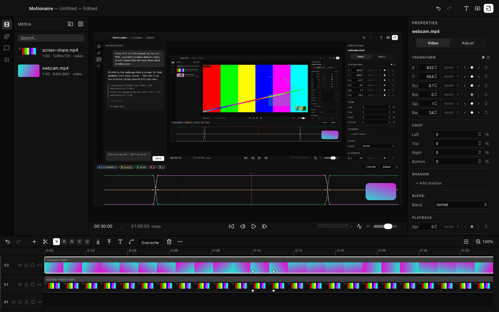

# Motionaire

**The video editor you talk to.** Type *"From 0:10 to 0:45 shrink my face to
10%, rounded corners, bottom right, screen share fills the rest, then back to
fullscreen"* — and that's exactly what happens. Real keyframes land on a real
timeline, you see it instantly, and one ⌘Z takes it all back.

Free and open source, for macOS.



## Download

**[Get the latest DMG →](https://github.com/4mohdisa/motionaire/releases/latest)**

You'll need macOS 13+ on Apple Silicon, and FFmpeg on your PATH
(`brew install ffmpeg`).

The app isn't notarized yet — that takes an Apple Developer membership this
project doesn't have — so macOS will warn you on first launch. Right-click →
Open, or:

```bash
xattr -cr /Applications/Motionaire.app
```

Every line of the app is public, so you can read exactly what you're running.

## The idea

Most AI video tools generate footage and hope you like it. Motionaire's AI
does something plainer: it makes the same edits you would — trims, keyframes,
titles — through the same controls the rest of the app uses. It never draws a
frame.

That buys you three things: edits are **instant** (nothing renders before you
see it), every prompt is **one undo step**, and whatever the AI made is just
clips and keyframes you can grab and reshape yourself.

## What's inside

A full editor, not a demo around a chatbot:

- Multi-track timeline with filmstrips, ripple/roll/slip/slide trims, markers,
  insert/overwrite, compound clips, and proxies that keep 4K footage smooth
- Keyframes on everything, with a bezier graph editor
- Color wheels, RGB curves, 3D LUTs, chroma key, masks — and scopes that read
  the actual render
- Proper audio: mixer, meters, EQ, compressor, gate, de-esser, ducking, LUFS
- Sixteen transitions, track mattes, motion blur, auto-reframe
- Export to H.264, HEVC, ProRes 422, GIF, PNG sequence, or M4A — with ranges,
  presets, chapters, and a queue
- AI video generation (Seedance / Google Veo) straight into the media bin,
  with the cost shown before a credit is spent



## AI setup

Preferences (⌘,) → **AI**: pick Anthropic or OpenAI, paste a key, hit Test.
**Keys are stored in the macOS Keychain and only ever read by the Rust core**
— they never touch the UI layer and never leave your machine except to the
provider you chose. No key? An offline mock provider runs the demo prompts
for free. There's no telemetry — none was ever put in.

## Build it yourself

You'll need [Node.js](https://nodejs.org) 20+, [Rust](https://rustup.rs)
(stable), FFmpeg, and Xcode Command Line Tools.

```bash
npm install
npm run tauri dev         # dev app with hot reload
npm test                  # the full suite: unit, e2e, visual regression (see TESTING.md)
bash scripts/release.sh   # release .app + .dmg
```

More detail lives next to the code: [apps/frontend](apps/frontend/README.md)
(the UI), [apps/backend](apps/backend/README.md) (the Rust core), and
[landing/](landing/README.md) (the website).

## How it works

```
your words → tool calls → the project file → the compositor → pixels
```

The project is a JSON document. The UI edits it through one store; the AI
edits it through the exact same store. A Rust/wgpu compositor turns it into
pixels — the same code for the live preview and the export, which is why what
you see is what encodes. FFmpeg handles decode and encode using the copy
already on your machine.

The deeper story is in [CONTEXT.md](CONTEXT.md) (the spec),
[DECISIONS.md](DECISIONS.md) (an honest engineering log of every session),
and [DEMO.md](DEMO.md) (a presenter script).

## Honest limitations

- macOS only, Apple Silicon, not notarized yet.
- The real-provider AI paths were built against current provider docs but
  verified with an offline mock — everything after the model is identical
  either way. If something misbehaves with a real key, please open an issue.
- Track audio effects have no mixer UI yet; speed-ramped clips are
  video-only; no transcription or captions yet.

## License & author

[AGPL-3.0-only](LICENSE) — free to use, study, and modify; if you ship a
modified version, your changes stay open too.

Built by **Mohammed Isa** — [@4mohdisa](https://github.com/4mohdisa) ·
[isaxcode.com](https://isaxcode.com)
